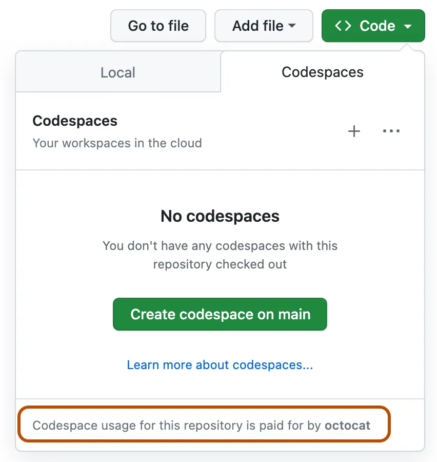

# 00 - Quick Start


## Lab 0 · Get Copilot CLI Running in Your Repo

You've just created your own repo from the template (shown on screen). Two paths from here, pick one:

- **Copilot CLI installed on your machine?** -> [Section 1](#1--local-copilot-cli)
- **Can't install it and requested a cloud environment during registration?** -> [Section 2](#2--github-codespaces-nothing-to-install)

Either way, you're done when the Copilot CLI prompt is open in your repo and `/usage` responds.

---

## 1 · Local Copilot CLI

Clone the repo you just created (the org and name you chose in the on-screen step) and step into it:

```bash
gh repo clone hackathon-green-bee-80/GitHub-Copilot-Foundations
cd GitHub-Copilot-Foundations
copilot
```

If clone fails with a 404, your `gh` CLI is probably still on your enterprise account. Run `gh auth login` with your private account first, or jump to [Section 2](#2--github-codespaces-nothing-to-install).

Use the right account. Today runs on the **private github.com account you provided at registration**, not your enterprise identity. Inside Copilot CLI:

```text
/logout
/login
```

Follow the device-code flow in the browser and sign in with the private account. Check that `/usage` responds. Then continue to [01 - Copilot CLI 101](01-cli-101.md).

## 2 · GitHub Codespaces (Nothing to Install)

First, in your browser, make sure github.com is logged in as your **personal registration account**. The codespace will belong to whoever creates it.

On the page of the repo you created in the hackathon organization:

1. Select the green **Code** button.
2. Open the **Codespaces** tab.
3. Choose **Create codespace on main**.

Wait for the container to build (about 2 minutes; it pre-installs Node 22 and Copilot CLI). Then, in the codespace terminal:

```bash
curl -fsSL https://gh.io/copilot-install | sudo bash
copilot
```



The codespace already runs as your private account, so no extra login is needed. Check that `/usage` responds, then continue to [01 - Copilot CLI 101](01-cli-101.md).
