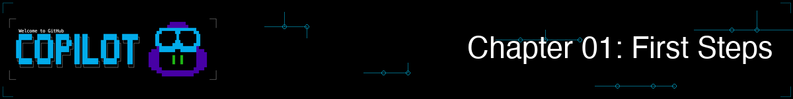
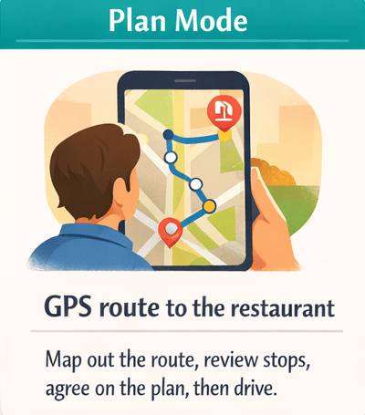

# 01 - First Steps

## What You Will Do

Try the three ways to use Copilot CLI and notice how each one feels.

In this chapter, you will try review, explain, and generate prompts, then compare the three Copilot CLI modes.

## Goal

By the end of this chapter, you should know when to use interactive, plan, and programmatic modes.
## CLI Commands for This Chapter

| Command | Where to run it | Purpose |
|---|---|---|
| `copilot --name=first-steps-demo` | Terminal | Start a named interactive session |
| `/plan <task>` | Copilot session | Ask the Plan agent to outline work |
| `/exit` | Copilot session | End the interactive session |
| `copilot --silent -p "<prompt>"` | Terminal | Run a one-shot prompt |
| `copilot -i "<prompt>"` | Terminal | Run a one-shot prompt with visible output |
| `copilot --resume=first-steps-demo` | Terminal | Resume the named session |

## Bookstore Use Case: Investigate the App

The bookstore app runs, but you are new to its code. Your first assignment is to investigate how books are added and decide how to prevent invalid book data from being saved.

Keep all work focused on `samples/book-app-project/`.

## Live Follow-Along

### Step 1: Start the Investigation

1. Start interactive mode: `copilot --name=first-steps-demo`
2. Keep this session open through the planning step.

### Step 2: Investigate with Interactive Mode

1. Run this prompt: `Review this file for bugs and quality issues: @samples/book-app-project/books.py`
2. Run this prompt: `Explain what this file does in simple terms: @samples/book-app-project/book_app.py`
3. Run this prompt: `Generate a function that validates a book title and returns a friendly error message if it is empty.`
4. Ask one follow-up in the same session: `Which issue should I fix first if I only have 10 minutes?`

> **Checkpoint:** Confirm that the review identifies missing input validation as a risk. Do not change code yet.

See demo output (optional)

### Step 3: Plan the Fix Before Coding

1. In the same session, run: `/plan Add validation for empty book titles before a book is saved.`
2. Read the step-by-step plan and check whether it covers where to change code, how to test, and what edge cases to handle.

> **Checkpoint:** The plan should mention `BookCollection.add_book` and tests for empty titles.

### Step 4: Try a Visible One-Shot Task

1. Exit interactive mode: `/exit`
2. Run this one-shot command in your terminal:
	`copilot -p "Generate a Python function named validate_title(title) that returns a friendly error message when the title is empty, otherwise returns None."`
3. Run this one-shot compare command:
	`copilot -p "In one sentence, compare interactive, plan, and programmatic mode."`

> **Checkpoint:** Both one-shot commands should print a response and return to PowerShell. If output is not visible, use `copilot -i "In one sentence, compare interactive, plan, and programmatic mode."` instead.

### Wrap Up: Resume and Brief Your Team

1. Run: `copilot --resume=first-steps-demo`
2. Ask: `Summarize what each mode was best for in a 3-row table.`
3. Carry the empty-title validation risk into Chapter 02, where you will improve the recommendation with better context.

### What We Achieved Together

We investigated the inherited app in interactive mode, planned a safe title-validation change, and used programmatic mode for visible one-shot output. We learned when to use conversation, planning, and automation.

Continue to Chapter 02, where we add file and folder context to confirm the validation path.