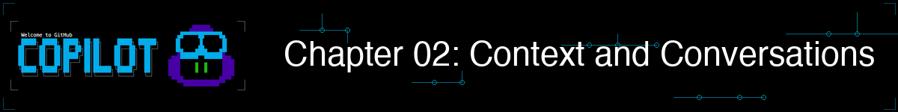

# 02 - Context and Conversations



## What You Will Do

Investigate the bookstore code by adding file and folder context step by step.

In this chapter, you will compare single-file, multi-file, and directory context, then continue the conversation without starting over.

## Goal

By the end of this chapter, you should know how to investigate unfamiliar code, give Copilot useful repository context, and resume a conversation.
## CLI Commands for This Chapter

| Command | Where to run it | Purpose |
|---|---|---|
| `copilot --name=context-demo` | Terminal | Start a named context session |
| `@<file-or-directory>` | Copilot prompt | Add file or directory context |
| `/exit` | Copilot session | End the current session |
| `copilot --continue` | Terminal | Resume the most recent session |
| `copilot --resume=context-demo` | Terminal | Resume the named context session |

## Bookstore Use Case: Investigate the App

The bookstore app runs, but you are new to its code. Your first assignment is to investigate how books are added and decide how to prevent invalid book data from being saved.

Keep all work focused on `samples/book-app-project/`.

## Live Follow-Along

### Step 1: Start the Investigation

1. Start a named session: `copilot --name=context-demo`
2. Keep this session open through the context exercises.

### Step 2: Build Context Step by Step

1. Run this single-file prompt:

	```text
	Review @samples/book-app-project/books.py for bugs, quality issues, and missing validation.
	```

2. Run this multi-file prompt:

	```text
	Compare @samples/book-app-project/book_app.py and @samples/book-app-project/books.py. How do they work together?
	```

3. Run this directory prompt:

	```text
	Review @samples/book-app-project/ for error handling issues and trace how an empty book title could be saved.
	```

4. Ask:

	```text
	Which issue should I fix first if I only have 10 minutes?
	```

> **Checkpoint:** Notice how the answer becomes more specific as Copilot sees one file, two files, and the full sample folder. Do not change code yet.

<details>
<summary>See context demos (optional)</summary>


</details>

### Step 3: Continue the Conversation

1. Run:

	```text
	Continue from the last answer and explain the validation problem in simple terms.
	```

2. Run:

	```text
	Which files and tests should change to fix it?
	```

3. Run:

	```text
	Summarize your recommended first fix in two sentences.
	```

> **Checkpoint:** Copilot should use the context already established in Step 2 without requiring you to repeat every file path.

### Step 4: Leave and Continue Later

1. Exit with `/exit`, then run `copilot --continue`.
2. Ask:

	```text
	What was the first fix you recommended earlier?
	```

3. Exit with `/exit`, then run `copilot --resume=context-demo`.
4. Ask:

	```text
	Summarize what we discussed in this session so far.
	```

> **Checkpoint:** Confirm that both continuation methods preserve the conversation context.

### Optional: Check Persistent Memory

1. Run `/memory on`.
2. Ask:

	```text
	Remember that I prefer pytest for Python tests in this workshop. Save this preference to memory.
	```

3. Run `/memory show` to confirm that Memory is enabled. This command shows the status, not the saved preferences.
4. Open [Copilot Memory settings](https://github.com/settings/copilot/memory) to view or delete stored preferences.
5. Start another session and ask:

	```text
	Which Python test framework do I prefer?
	```

	Check whether Copilot recalls the preference.

6. Run `/memory off` if you prefer sessions without saved memories.

> **Checkpoint:** Copilot should confirm that it saved the pytest preference before you test recall in another session.

Memory is in public preview. Availability and recall can vary by CLI version, account, and active billing entity.

### Wrap Up

Save the recommended first fix for Chapter 03, where you will implement and test it.

### What We Achieved Together

We investigated the inherited app, expanded from one file to the full sample folder, traced the validation path, and resumed the conversation without losing context.

Continue to Chapter 03, where we implement and test the validation change.