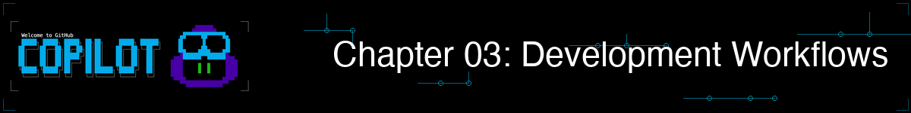
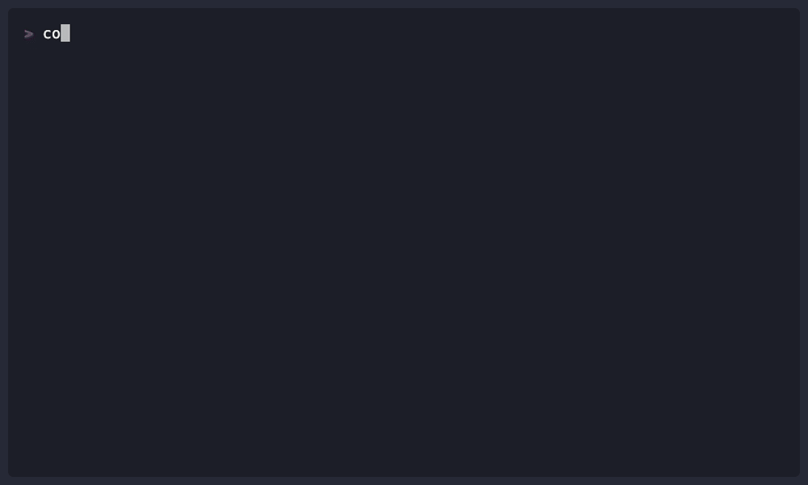

# 03 - Development Workflows



## What You Will Do

Use Copilot for everyday engineering work: review, refactor, debug, test, and Git tasks.

## Goal

By the end of this chapter, you should see how Copilot can help with the main daily development tasks.
## CLI Commands for This Chapter

| Command | Where to run it | Purpose |
|---|---|---|
| `copilot --name=workflow-demo` | Terminal | Start the workflow session |
| `/plan <task>` | Copilot session | Plan a focused code change |
| `/diff` | Copilot session | Review changes made in the session |
| `/pr auto` | Copilot session | Choose the appropriate pull request action |
| `/exit` | Copilot session | End the workflow session |
| `copilot --resume=workflow-demo` | Terminal | Resume the named session |

## Bookstore Use Case: Fix Empty Book Titles

You confirmed that empty book titles can reach `BookCollection.add_book`. Your team has assigned you a small quality pass: implement the validation, protect it with tests, review the diff, and prepare the change for a pull request.

The work follows five practical workflow lanes in the same bookstore project.


You will move from finding issues to shipping changes:

1. Review and prioritize.
2. Refactor safely.
3. Debug the main risk.
4. Add tests for confidence.
5. Prepare commit and PR communication.

## Live Follow-Along

### Step 1: Start the Quality Pass

1. Start Copilot: `copilot --name=workflow-demo`
2. Keep this same session open for all workflow prompts below.

### Step 2: Review and Prioritize

Start by creating a prioritized issue list. This gives you a confident starting point for all later tasks.


#### Basic Review

This step uses the `@` symbol to reference a file so Copilot can read the exact code before reviewing it.

#### Why this matters

Starting with review gives you a clear list of issues so you can choose the most important fix first.

1. Run:

	```text
	Review @samples/book-app-project/books.py for bugs, quality issues, and missing validation.
	```

2. Run:

	```text
	Now create a markdown checklist grouped as Critical, High, Medium, Low.
	```

3. Run:

	```text
	Which one issue should I fix first and why?
	```

> **Checkpoint:** Use missing validation for empty book titles as the shared first issue, even if Copilot reports other valid findings.

<details>
<summary>See demo output (optional)</summary>


</details>

### Step 3: Plan and Implement the Smallest Fix

Use the issue from Step 2 to make one focused change. This guarantees that `/diff` has a real session change to display later.


#### Change with intent

Plan first, then ask Copilot to edit only the validation path and its tests.

1. Run: `/plan Add validation that prevents an empty or whitespace-only book title from being saved.`
2. Run:

	```text
	Implement that plan in @samples/book-app-project/books.py. Raise ValueError with a friendly message and do not change unrelated behavior.
	```

3. Run:

	```text
	Add focused pytest tests in @samples/book-app-project/tests/ for an empty title, a whitespace-only title, and a valid title.
	```

4. Run:

	```text
	Run the workshop book app tests and report the result.
	```

> **Checkpoint:** Copilot should have changed source and test files, and the focused tests should pass before you continue.

<details>
<summary>See demo output (optional)</summary>


</details>

### Step 4: Review and Repair the Change

Now inspect the actual session changes and repair only a concrete issue found in them.


#### Review from evidence

Use `/diff` before asking for another code change.

1. Run: `/diff`
2. Run:

	```text
	Review the current validation changes for bugs, unintended behavior changes, and missing edge cases. Report findings before editing.
	```

3. If Copilot finds a real issue, run:

	```text
	Fix only the highest-severity finding, then rerun the focused tests.
	```

4. If there are no findings, run:

	```text
	Explain why this change is safe in two sentences.
	```

> **Checkpoint:** The diff should show both implementation and test changes. Tests should still pass after any repair.

<details>
<summary>See demo output (optional)</summary>


</details>

### Step 5: Check Test Coverage

After refactor and bug fix work, lock behavior with tests so regressions are caught early.


#### Test what can break

Edge-case tests protect your refactor and bug fix work from regressions.

1. Run:

	```text
	Review @samples/book-app-project/tests/ for coverage of the new title validation behavior.
	```

2. Run:

	```text
	List any missing edge-case test without changing files.
	```

3. If one is missing, run:

	```text
	Add only the highest-value missing test and rerun the focused tests.
	```

> **Checkpoint:** Every new validation rule should have at least one focused pytest test.

<details>

<summary>See demo output (optional)</summary>



</details>

### Step 6: Prepare to Ship

Finish by turning technical work into clear reviewer communication.


#### Communicate clearly in Git

Good commit and PR text helps reviewers understand what changed and why.

1. Run: `/diff` to review all changes made during this Copilot session.
2. Run:

	```text
	Summarize my current changes in one short paragraph.
	```

3. Run:

	```text
	Write a short commit message for the changes I made.
	```

4. Run:

	```text
	Draft a 4-bullet PR description with Summary, Changes, Testing, and Risks.
	```

5. If you are on a feature branch with a GitHub remote, run: `/pr auto` to let Copilot choose the appropriate pull request action. Otherwise, stop after drafting the PR description.

<details>
<summary>See demo output (optional)</summary>


</details>

### Wrap Up: Resume and Share the Summary

1. Exit with `/exit`
2. Resume with `copilot --resume=workflow-demo`
3. Ask:

	```text
	Summarize the top recommendation from each workflow in a table.
	```

4. Take the same changed files into Chapter 04 to compare a general review with a specialist Python reviewer.

### What We Achieved Together

We prioritized a real validation risk, implemented the smallest focused change, added pytest coverage, reviewed the session diff, and prepared clear commit and pull request communication.

Continue to Chapter 04, where we compare a general review with a specialist Python reviewer.