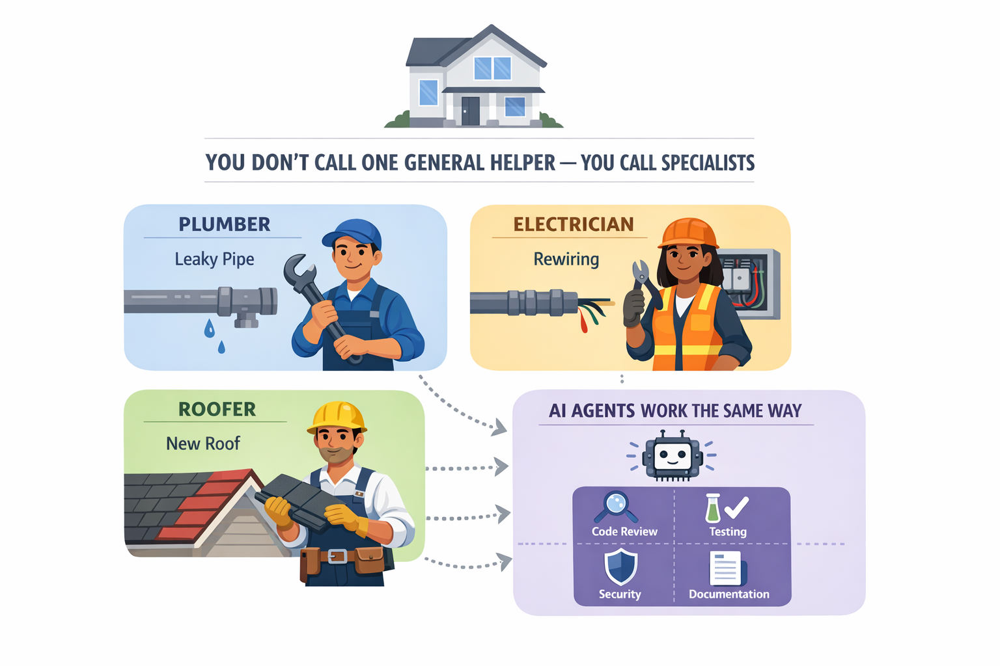

# 04 - Agents and Custom Instructions

## What You Will Do

See how a specialist agent changes the style and consistency of the answer.

In this chapter, you will compare a general prompt with a specialist agent and see how custom instructions change the result.

## Goal

By the end of this chapter, you should understand when to use a specialist agent instead of a general prompt.
## CLI Commands for This Chapter

| Command | Where to run it | Purpose |
|---|---|---|
| `copilot --name=agents-demo` | Terminal | Start the agent comparison session |
| `/agent` | Copilot session | Open the agent picker |
| `copilot --agent=python-reviewer` | Terminal | Start directly with the custom reviewer |
| `/plan <task>` | Copilot session | Use the built-in Plan agent |
| `/review` | Copilot session | Use the built-in review agent |
| `/exit` | Copilot session | End the current session |
| `copilot --resume=agents-demo` | Terminal | Resume the named session |

## Bookstore Use Case: Standardize Python Reviews

You implemented title validation and tests in Chapter 03. The team now wants a repeatable Python review standard, so you will compare a general review with a specialist review of the same code.

## Real-World Analogy: Hiring Specialists

Agents are like hiring the right specialist for a specific job instead of asking one general helper to do everything.

In this chapter you will:

1. Compare generic output with specialist output.
2. Capture what changed and why it is better.
3. Turn those patterns into reusable team rules.

## Live Follow-Along

### Step 1: Start as a General Reviewer

1. Start Copilot: `copilot --name=agents-demo`.
2. Do not select a custom agent yet.

## How Agents Work

Use this quick model:

| Type | How You Use It | Best For |
|---|---|---|
| Built-in agent | `/plan`, `/review`, or automatic routing | Common workflows like planning and review |
| Custom agent | `/agent` picker or `copilot --agent=<name>` | Team-specific behavior and standards |

Helpful checks during practice:

1. Ask: `Which agent are you using right now?`
2. Ask: `What constraints or focus areas are active for this agent?`

Agents change how Copilot reasons for a class of tasks, not just one prompt. You used the built-in Plan agent with `/plan` in earlier chapters; this chapter focuses on comparing a general review with a custom agent.

### Step 2: Capture the General Review

#### Baseline first

Start with a general prompt so you can compare it fairly against specialist output.

#### Why this matters

This shows how role-specific instructions improve consistency and depth.

1. Run: `Review @samples/book-app-project/books.py and @samples/book-app-project/tests/ for bugs and quality issues.`
2. Ask: `Summarize your review criteria in five bullets.`

> **Checkpoint:** Keep this response in the session. It is the baseline for the specialist comparison.

### Step 3: Switch to the Python Reviewer

1. Run `/agent`.
2. Select `python-reviewer`.
3. Run the same prompt: `Review @samples/book-app-project/books.py and @samples/book-app-project/tests/ for bugs and quality issues.`
4. Run: `Compare the generic review and python-reviewer review in a short table.`

> **Checkpoint:** Identify one criterion the specialist applied more consistently or explicitly.

See an agent demo (optional)

### Step 4: Turn the Difference into Team Rules

#### Turn behavior into standards

After comparison, capture the good patterns as team guidance.

1. Run: `Where do custom instructions live in this project?`
2. Run: `Show a minimal custom instruction set that enforces concise bug-first reviews.`
3. Run: `How can a team share and reuse this same agent setup?`

> **Checkpoint:** The answer should distinguish project instructions from an agent selected for a specialized task.

### What We Achieved Together

So far in the workshop, we have:

1. Started Copilot CLI and explored the inherited book app.
2. Used file and folder context to trace how book data moves through the app.
3. Identified title validation as a priority, implemented it, and added tests.
4. Reviewed the same code with a general prompt and the `python-reviewer` agent.
5. Saw that a specialist agent applies a more focused and repeatable quality standard.

The main takeaway is simple: use a general prompt for flexible, one-off help and a specialist agent when the same expertise and standards should be applied repeatedly.

Continue to Chapter 05, where we package a repeatable quality checklist as an automatically discovered skill.

### Optional Demo: Resume the Session

To demonstrate session continuity:

1. Exit with `/exit`.
2. Resume with `copilot --resume=agents-demo`.
3. Ask: `Summarize when to use generic prompts vs specialist agents in three bullets.`
