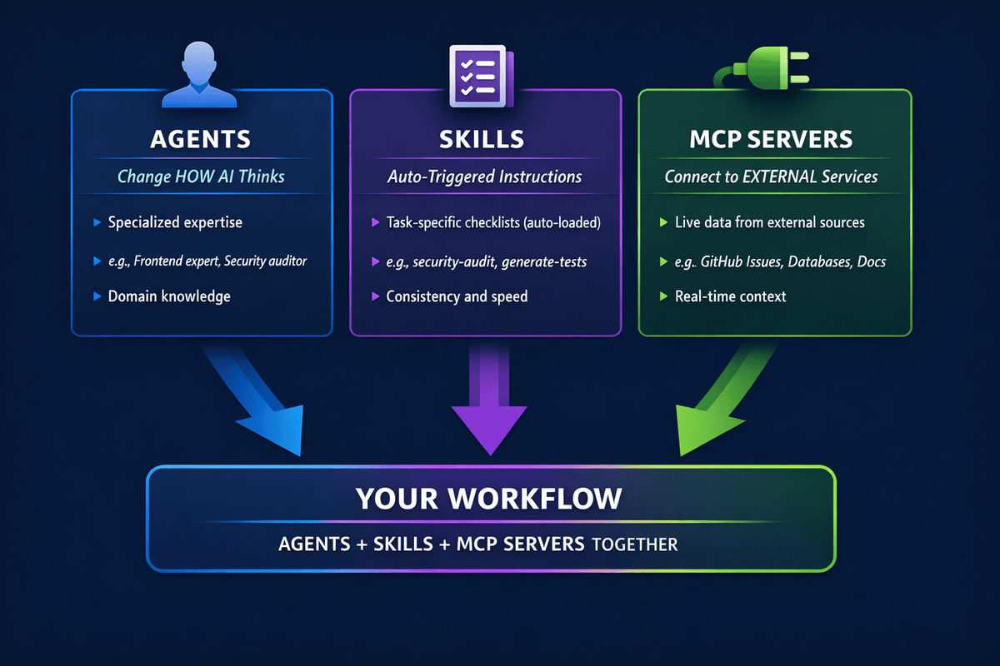

# 05 - Skills


## What You Will Do

See how skills automate repeatable checks so you do not have to restate the same rules.

In this chapter, you will run a skill-based prompt, compare it with a normal prompt, and see how skills keep checks consistent.

## Goal

By the end of this chapter, you should know how skills help keep answers consistent.

## Choose Your Own Adventure

If you are short on time, pick one outcome first.

| I want to... | Start with... |
|---|---|
| Discover and test a skill quickly | Task 1: Discover and Trigger a Skill |
| Compare skill output vs normal output | Task 2: Compare Against a Plain Prompt |

For full understanding, do Task 1 then Task 2.

## Follow Along

Use the book app sample as your practice example: `workshop/samples/book-app-project/`.

## Real-World Storyline: Skills as Tool Attachments

Think of Copilot like a power tool. It works out of the box, but specialized attachments make it reliable for specific jobs.


In this chapter we are going to:

1. Start with general behavior.
2. Add one reusable skill.
3. Compare consistency with and without the skill.
4. Capture when to use skills vs agents vs MCP.

### Start Here: Start with No Skill Assumptions

1. Start Copilot: `copilot --name=skills-demo`

## *New to Skills?* Start Here!

1. **See what skills are available:**
	```bash
	/skills list
	```
	This shows built-in skills plus project and user skills.
2. **Look at a real skill file:** `.github/skills/code-checklist/SKILL.md`
3. **Understand the core idea:** skills are auto-applied when your prompt matches a skill's description.

## How Skills Work

Skills are task-specific instruction folders. Copilot checks your prompt, matches likely skills, and loads them automatically.

Example behavior:

```bash
Check books.py against our quality checklist
# Copilot can auto-match a code-checklist skill

Generate tests for the BookCollection class
# Copilot can auto-match a pytest generation skill
```

Direct invocation is also available when you want explicit control:

```bash
/code-checklist Review @workshop/samples/book-app-project/books.py
```

## Skills vs Agents vs MCP

Use this quick mental model:



| Feature | What It Does | When to Use |
|---|---|---|
| Agents | Changes how Copilot reasons | You need specialized expertise across many tasks |
| Skills | Adds task-specific instructions | You repeat the same type of checks often |
| MCP | Connects external systems | You need live context from tools and services |

## From Manual Prompts to Automatic Expertise

Before skills, teams rewrite long prompts and still miss checklist items.

After skills, a short request can apply a full checklist consistently.


Use this compare prompt to observe the difference:

1. Run: `Review @workshop/samples/book-app-project/books.py for quality issues.`
2. Run: `Now apply a checklist-driven review for the same file.`
3. Ask: `What changed in structure, consistency, and actionability?`

### Task 1: Discover and Trigger a Skill

#### Find what is available

Use `/skills list` to see what can run before writing any custom prompt.

#### Why this matters

Skills reduce repetition by automatically applying team rules.

1. Run: `/skills list`
2. If needed, load the local workshop skill: `Copy-Item workshop/skills/code-checklist .github/skills/code-checklist -Recurse -Force`
3. Run: `Review @workshop/samples/book-app-project/books.py using the code-checklist skill.`
4. Run: `List which checklist categories you applied in this review.`

<details>
<summary>See a trigger demo (optional)</summary>


</details>

### Task 2: Compare Against a Plain Prompt

#### Compare structure and actionability

Run the same task without a skill to see the difference in consistency.

1. Run: `Now review @workshop/samples/book-app-project/books.py without using any skill.`
2. Run: `Compare the two outputs in one paragraph: consistency, structure, and actionability.`
3. Run: `Where are skills stored in this project, and how can a team share them across projects?`

### Wrap Up: Resume and Pick the Right Tool

1. Exit with `/exit`
2. Resume with `copilot --resume=skills-demo`
3. Ask: `Summarize when to use a skill, when to use an agent, and when to use a plain prompt.`
4. Move to Chapter 06 to extend this workflow with trusted external MCP tools.

## How To Follow Along

- Follow the steps in order: discover, compare, then decide.
- Keep one session open so comparison stays grounded in one task.
- Use the resume step to show that your workshop conversation is saved.
- If skill behavior seems stale after edits, run `/skills reload`.

## Your Practice Step

Create one new mini skill idea with 3-5 rules for your team and test it on one file.

## What Success Looks Like

You should see more consistent and reusable feedback when the skill is used.

## Workshop Tip

Use skills for repeatable standards and checklists, not one-off creative prompts.