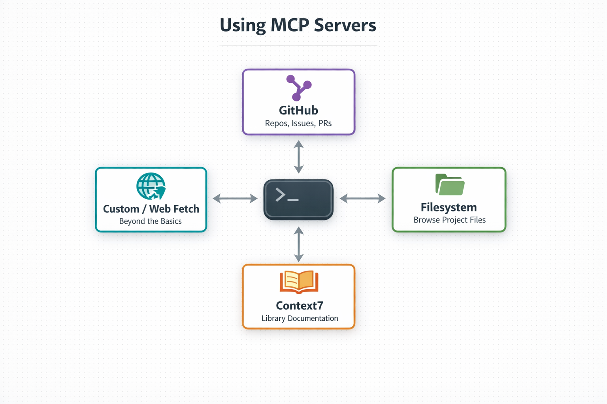
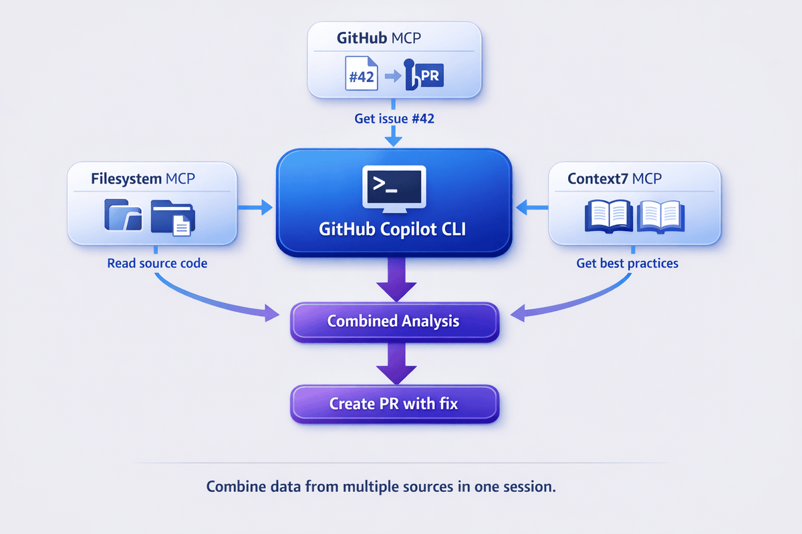
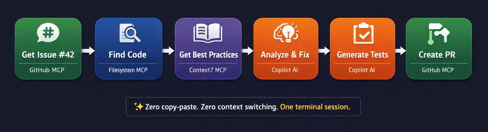

# 06 - MCP Servers

## What You Will Do

See how Copilot can connect to external tools and live context through MCP.

In this chapter, you will inspect MCP servers, try a live-context prompt, and define safe usage boundaries.

## Goal

By the end of this chapter, you should understand what MCP adds and why trust boundaries matter.

## Follow Along

Use this repository as your practice example and keep one chat session open across all tasks.

### Start Here: Confirm MCP Is Available

1. Start Copilot: `copilot --name=mcp-demo`

## *New to MCP?* Start Here!

1. **Run a fast proof:** ask for recent commits in this repository.
2. **Inspect available servers:** run `/mcp show`.
3. **Understand the core idea:** MCP lets Copilot reach trusted external context, not just local file snippets.

### Task 1: Verify Built-In MCP Value

#### Quick Start: MCP in 30 Seconds

1. Run: `List the recent commits in this repository.`
2. If commit details appear, MCP is active and returning live repository context.
3. Self-check: `Why is this result different from a file-only prompt?`

### Task 2: Inspect Servers and Trust Boundaries

#### The `/mcp show` Command

Use `/mcp show` to verify configured and enabled MCP servers.

1. Run: `/mcp show`
2. Confirm at least the built-in `github` server is listed.
3. Self-check: `Which listed server is required for commit and issue queries?`

#### What Changes with MCP?

Compare behavior with and without MCP-backed access.

1. Run: `What's in GitHub issue #42?`
2. Run: `What's in GitHub issue #42 of this repository?`
3. Self-check: `Which response is actionable and why?`

Key takeaway: with MCP, Copilot can fetch live issue and repository state when the right server is enabled.

### Task 3: Add One MCP Server

#### Configuring MCP Servers

Now set up additional servers using the same pattern as the full chapter.

1. You already proved MCP works with the built-in `github` server.
2. Now you show how to add one more server to expand capability.
3. Then you verify the new server appears in `/mcp show`.

#### Installing MCP Servers from the Registry

Use the registry for guided setup.

Demo script:

1. Say: `MCP works now. Next, I will add one server so you can see how capability grows.`
2. Run: `/mcp search` and pick one server.
3. Run: `/mcp show` and point out the new server entry.

1. Run: `/mcp search`
2. Select one server from the picker.
3. Complete prompts shown by the CLI.
4. Run: `/mcp show` to verify the server is enabled.

#### MCP Configuration File

Use this when you want manual, shareable setup.

Where MCP config is stored:

1. User-level: `~/.copilot/mcp-config.json`
2. Project-level: `.mcp.json`
3. Workspace-level: `.github/mcp.json`

1. Run: `Show me a minimal mcp-config.json example with one local server.`
2. Ask: `When should I keep MCP config user-level vs commit it to the repository?`
3. Self-check: `For a solo setup, which config location should I use first and why?`

Practical guidance:

1. Use user-level config for personal experiments.
2. Use project/workspace config when teammates should share the same MCP behavior.
3. Keep tool scope narrow and enable only what a task needs.

### Task 4: Run a Quick MCP Workflow

#### Using MCP Servers

Use MCP when you need live information from connected tools instead of only local file context.

1. Run: `Using available MCP tools, summarize this repository's chapter structure.`
2. Run: `Using MCP, list recent bug-fix commits in this repository.`
3. Self-check: `What did MCP fetch that a file-only prompt could miss?`

See a full MCP workflow demo (optional)

## MCP Workflow Scenarios

Each example below is self-contained. **Pick one that interests you, or read them all.**

Demo flow for each example:

1. Run the prompt.
2. Read the output aloud.
3. Ask one quick reflection question.

### Multi-Server Exploration

1. Demo prompt: `List recent bug-fix commits in this repository.`
2. Demo prompt: `Now list open issues related to those bug-fix areas.`
3. Reflection: `Which server/tool gave commit data vs issue data?`

### Issue-to-PR Workflow

1. Demo prompt: `Show recent commits that changed workshop chapter files.`
2. Demo prompt: `Using available MCP docs tools, find one best practice relevant to workshop documentation updates.`
3. Reflection: `What new information came from MCP vs local file context?`

### Health Dashboard

1. Demo prompt: `Summarize current open issues and latest related commits for one feature area.`
2. Demo prompt: `Create a 3-bullet next-step plan based on that live project context.`
3. Reflection: `Would this plan be weaker without MCP? Why?`

## Adding MCP Servers

After proving built-in value, add one server to extend capability.

1. Run: `/mcp search`
2. Select one server and complete setup prompts.
3. Run: `/mcp show` and verify the new server is enabled.
4. Self-check: `How did the new server expand what I can ask?`

### Wrap Up: Resume and Share MCP Value

1. Exit with `/exit`
2. Resume with `copilot --resume=mcp-demo`
3. Ask: `Summarize MCP value in this workshop in four bullets.`
4. You now have the complete MCP story: quick value, server visibility, behavior change, and extension.

## How To Follow Along

- Follow the story sequence from quick start to adding one new server.
- Keep prompts short so MCP tool usage is easy to observe.
- Keep scope narrow: only enable tools needed for the current task.
- Use the resume step to show the conversation can be continued later.
- If you update MCP configuration files, restart or re-open your Copilot session before re-testing.

## Your Practice Step

Choose one real task, use MCP to gather live context, and note one new insight MCP gave you.

## What Success Looks Like

You should understand that MCP extends Copilot beyond local files and improves real-world task answers.

## Workshop Tip

Start with one server, prove value with a real task, then add more only when needed.